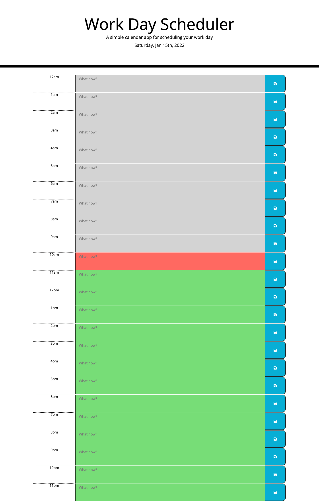

# PlanningTheDaily
A web app to track your schedule and ace the day. 

## Functionality
This schedular displays the current day with a block for each hour. 

You are able to write in each time block and then save it using the corresponding button.

The time blocks are colour coded: 
- **Grey**: All previous hours.
- **Red**: The current hour.
- **Green**: All coming hours.

Upon a new day, the activities of yesterday are removed to start fresh.

## UI

The user interface is intuitive and easy to use. Below is a screen shot to showcase the UI.

## Access

To utilise this tool, follow this link: https://kbario.github.io/PlanningTheDaily/